# whatsapp-ai-agent-n8n
# 💬 WhatsApp Auto Reply Bot — Sleep, Busy & Available

A smart WhatsApp auto-reply bot that automatically responds to incoming messages based on your current status. Set yourself as **Available**, **Busy**, or **Sleeping** from a mobile-friendly webpage — the bot does the rest.

---

## 📋 Table of Contents

- [What This Does](#what-this-does)
- [System Architecture](#system-architecture)
- [Tech Stack](#tech-stack)
- [How Each Service Works](#how-each-service-works)
- [Complete Data Flow](#complete-data-flow)
- [Pipeline Breakdown](#pipeline-breakdown)
- [Control Webpage](#control-webpage)
- [Environment Variables](#environment-variables)
- [Database Setup](#database-setup)
- [Bugs & Fixes Log](#bugs--fixes-log)
- [Design Decisions & Trade-offs](#design-decisions--trade-offs)
- [How to Reproduce](#how-to-reproduce)
- [Known Limitations](#known-limitations)

---

## What This Does

When someone sends you a WhatsApp message:

- If you're **Available** → no reply (normal mode)
- If you're **Busy** → auto-replies: *"Hey! I'm a bit busy right now 🙏 I'll reply as soon as I'm free!"*
- If you're **Sleeping** → auto-replies: *"Hey! I'm asleep right now 😴 I'll get back to you in the morning!"*
- If it's **11PM–7AM IST** and you haven't set a status → auto-sleep kicks in automatically

You control your status from a webpage bookmarked on your phone home screen. One tap updates everything instantly.

---

## System Architecture


---

## Tech Stack

| Component | Tool | Purpose |
|---|---|---|
| Workflow Engine | n8n | Runs all automation logic |
| Hosting | Render.com (Free tier) | Where n8n is hosted |
| WhatsApp Bridge | GREEN-API | Sends and receives WhatsApp messages |
| Database | Neon.tech (PostgreSQL) | Stores current status persistently |
| Control UI | HTML/CSS/JS | Mobile webpage to change status |
| UI Hosting | Netlify | Hosts the control webpage |

---

## How Each Service Works

### n8n (Automation Engine)
n8n is like a visual flowchart that runs code. Each box in the flowchart is a "node" that does one job — check a condition, run a query, send an HTTP request. When a WhatsApp message arrives, it triggers the first node and the data flows through each node in sequence.

n8n is hosted on Render.com and runs 24/7 (with a keep-alive ping every 10 minutes to prevent sleep on the free tier).

### GREEN-API (WhatsApp Bridge)
GREEN-API connects a real WhatsApp account to your automation. It:
- Listens for incoming WhatsApp messages on your number
- Forwards each message to your n8n webhook URL as an HTTP POST
- Sends outgoing replies when n8n tells it to via HTTP POST

### Neon PostgreSQL (Database)
A single table called `bot_state` with one row stores your current status:

```
key     | value
--------+-----------
status  | available   ← could be: available, busy, sleeping
```

This lives completely outside n8n, so it survives restarts, redeployments, and crashes.

### Netlify (Control UI Hosting)
A single HTML file is deployed to Netlify. It's a mobile-friendly webpage with 3 buttons. When you tap a button, JavaScript calls the matching n8n webhook URL in the background, which updates the Neon DB.

---

## Complete Data Flow

### Flow 1: Changing Status (from webpage)


### Flow 2: Incoming WhatsApp Message

```mermaid
sequenceDiagram
    participant WA as Sender's WhatsApp
    participant GAPI as GREEN-API
    participant n8n as n8n Workflow
    participant DB as Neon PostgreSQL

    WA->>GAPI: Message sent to your number
    GAPI->>n8n: POST /webhook/whatsapp-incoming
    n8n->>n8n: Dedupe Check (ignore if replied < 1s ago)
    n8n->>DB: SELECT value FROM bot_state WHERE key='status'
    DB-->>n8n: "busy"
    n8n->>n8n: Compute effective status (check IST time for auto-sleep)
    n8n->>GAPI: POST sendMessage (busy reply)
    GAPI->>WA: "Hey! I'm a bit busy right now 🙏"
```



---

## Pipeline Breakdown

### Node 1: Incoming Message Webhook
- **Type**: Webhook (POST)
- **Path**: `/webhook/whatsapp-incoming`
- **What it does**: Receives all incoming WhatsApp messages from GREEN-API. GREEN-API sends the message data as a JSON body containing sender info, chat ID, and message content.

### Node 2: Dedupe Check
- **Type**: Code (JavaScript)
- **What it does**: Prevents replying to the same person multiple times within a short window. Reads sender's `chatId` from `body.senderData.chatId`, checks when they were last replied to using n8n static data, and blocks the flow if within the cooldown period.
- **Key setting**: `DEDUPE_SECONDS = 1` (change this to increase cooldown)
- **Important**: Ignores messages where `sender === 'me'` (your own outgoing messages)

### Node 3: Read Status from DB
- **Type**: Postgres
- **Query**: `SELECT value FROM bot_state WHERE key = 'status' LIMIT 1;`
- **What it does**: Fetches your current status from Neon. This is the single source of truth — completely separate from n8n so it never gets wiped.

### Node 4: Compute Effective Status
- **Type**: Code (JavaScript)
- **What it does**: Combines DB status with IST time check. If DB says `available` AND current IST hour is between 11PM and 7AM, it overrides to `sleeping`. If you've manually set `busy` or `sleeping`, it respects that regardless of time.

```javascript
// Auto-sleep logic
const isAutoSleepTime = istHour >= 23 || istHour < 7;
const effectiveStatus = (isAutoSleepTime && status === 'available') ? 'sleeping' : status;
```

### Node 5: Is Sleeping?
- **Type**: IF condition
- **Checks**: `effectiveStatus === 'sleeping'`
- **True branch** → Send Sleep Reply
- **False branch** → Is Busy?

### Node 6: Is Busy?
- **Type**: IF condition
- **Checks**: `effectiveStatus === 'busy'`
- **True branch** → Send Busy Reply
- **False branch** → Do nothing (available)

### Node 7/8: Send Reply
- **Type**: HTTP Request (POST)
- **Calls**: GREEN-API `sendMessage` endpoint
- **Uses**: `$env.GREEN_API_INSTANCE` and `$env.GREEN_API_TOKEN` from Render environment variables

### Status Control Webhooks (3 separate pipelines)

| Webhook Path | Query Run |
|---|---|
| `/webhook/set-available` | `UPDATE bot_state SET value='available' WHERE key='status'` |
| `/webhook/set-busy` | `UPDATE bot_state SET value='busy' WHERE key='status'` |
| `/webhook/set-sleeping` | `UPDATE bot_state SET value='sleeping' WHERE key='status'` |

Each returns `{"ok": true, "status": "..."}` so the webpage can confirm the update.

### Keep Alive Pipeline
- **Trigger**: Every 10 minutes (Schedule node)
- **Action**: GET `https://whatsapp-ai-agent-n8n.onrender.com/healthz`
- **Purpose**: Prevents Render free tier from spinning down the service

---

## Control Webpage

A single `index.html` file hosted on Netlify at `https://n8nstatus.netlify.app`

### Features
- Live IST clock showing current time
- Auto-sleep indicator (shows warning when in sleep hours but status is overridden)
- 3 status buttons: Available, Busy, Sleeping
- Tap feedback with loading state and toast confirmation
- Status persists in browser localStorage between visits
- Configurable webhook URL via ⚙ settings panel

### How it connects
```javascript
// When you tap "Busy":
const url = 'https://whatsapp-ai-agent-n8n.onrender.com/webhook/set-busy'
const res = await fetch(url, { method: 'GET' })
// n8n updates DB → next WhatsApp message reads new status
```

---

## Environment Variables

Set all of these in **Render → Environment**:

```
# Database (Neon PostgreSQL - use UNPOOLED host, not pooler)
DB_TYPE=postgresdb
DB_POSTGRESDB_HOST=ep-odd-star-a1oik9ap.ap-southeast-1.aws.neon.tech
DB_POSTGRESDB_PORT=5432
DB_POSTGRESDB_DATABASE=neondb
DB_POSTGRESDB_USER=neondb_owner
DB_POSTGRESDB_PASSWORD=your_neon_password
DB_POSTGRESDB_SSL_REJECT_UNAUTHORIZED=false

# n8n Public URL (required for webhooks to work)
N8N_HOST=whatsapp-ai-agent-n8n.onrender.com
N8N_PROTOCOL=https
WEBHOOK_URL=https://whatsapp-ai-agent-n8n.onrender.com/

# Security (prevents credential loss on restart)
N8N_ENCRYPTION_KEY=your_fixed_random_string_here

# Allow nodes to read env vars
N8N_BLOCK_ENV_ACCESS_IN_NODE=false

# GREEN-API credentials
GREEN_API_INSTANCE=your_instance_id
GREEN_API_TOKEN=your_api_token
```

---

## Database Setup

Run this **once** in the Neon SQL Editor:

```sql
CREATE TABLE IF NOT EXISTS bot_state (
  key TEXT PRIMARY KEY,
  value TEXT
);

INSERT INTO bot_state (key, value)
VALUES ('status', 'available')
ON CONFLICT DO NOTHING;
```

This table is permanent and survives all restarts.

---

## Bugs & Fixes Log

### Bug 1 — Credentials lost on every Render restart
**Symptom**: After every Render restart, n8n asked for setup again and credentials were gone.
**Cause**: Render free tier has no persistent disk. n8n was using SQLite stored on the filesystem which wiped on restart.
**Fix**: Connected Neon PostgreSQL as external DB via `DB_TYPE=postgresdb` env vars. Data now lives outside Render entirely.

### Bug 2 — Encryption key changing on every restart
**Symptom**: `Credentials could not be decrypted. A different encryptionKey was used.`
**Cause**: n8n auto-generates a random encryption key on startup if none is set. Every restart = new key = old credentials unreadable.
**Fix**: Set `N8N_ENCRYPTION_KEY` to a fixed value in Render environment.

### Bug 3 — Webhook URL showing localhost
**Symptom**: Production URL in n8n webhook node showed `http://localhost:5678/webhook/...` instead of the real URL.
**Cause**: n8n didn't know its own public URL.
**Fix**: Added `N8N_HOST`, `N8N_PROTOCOL`, and `WEBHOOK_URL` environment variables pointing to the Render domain.

### Bug 4 — DB connection failing with "unsupported startup parameter"
**Symptom**: n8n crashed on startup with `unsupported startup parameter in options: statement_timeout`
**Cause**: Was using the Neon **pooled** connection (`-pooler` in hostname). Neon's pooler doesn't support certain PostgreSQL startup parameters that n8n sends.
**Fix**: Switched to the **direct/unpooled** host by removing `-pooler` from `DB_POSTGRESDB_HOST`.

### Bug 5 — SSL connection error
**Symptom**: `connection is insecure (try using sslmode=require)`
**Cause**: Postgres credential in n8n had SSL set to `Allow` instead of `Require`.
**Fix**: Changed SSL setting to `Require` in the n8n Postgres credential.

### Bug 6 — "access to env vars denied" in Send Reply node
**Symptom**: Workflow reached Send Reply node but failed with `access to env vars denied`.
**Cause**: n8n blocks environment variable access inside nodes by default.
**Fix**: Added `N8N_BLOCK_ENV_ACCESS_IN_NODE=false` to Render environment.

### Bug 7 — `bot_state` table does not exist
**Symptom**: `relation "bot_state" does not exist` error in Read Status from DB node.
**Cause**: The database table was never created in Neon.
**Fix**: Ran the CREATE TABLE SQL in the Neon SQL Editor.

### Bug 8 — busyMode resetting on every publish (old system)
**Symptom**: Busy mode turned off every time workflow was published or Render restarted.
**Cause**: Old system stored `busyMode` in n8n static data which is wiped on republish.
**Fix**: Replaced with Neon PostgreSQL storage. Status now persists permanently in the DB.

### Bug 9 — GREEN-API webhook URL truncated
**Symptom**: Messages received by GREEN-API but not forwarded to n8n.
**Cause**: Webhook URL was saved as `...whatsapp-incomin` (missing final `g`) in GREEN-API console.
**Fix**: Re-entered the full URL carefully: `.../webhook/whatsapp-incoming`

### Bug 10 — Dedupe blocking all messages
**Symptom**: Workflow stopped at Dedupe node with 0 output items for every message.
**Cause**: `DEDUPE_SECONDS` was set to 60, blocking all test messages sent within 1 minute of each other.
**Fix**: Reduced to `DEDUPE_SECONDS = 1`.

---

## Design Decisions & Trade-offs

### Why Neon PostgreSQL instead of n8n static data?
Static data lives inside n8n's memory/filesystem and gets wiped on republish or restart. Neon is an independent external service — nothing n8n does can affect it. This was the single most important architectural decision.

### Why a simple HTML file instead of a React app?
No build step, no dependencies, instant deploy via Netlify Drop. The entire control UI is one file. For a simple 3-button interface, a framework would add complexity with zero benefit.

### Why GREEN-API instead of official WhatsApp Business API?
The official API requires a verified business account and Meta approval. GREEN-API works with a regular WhatsApp number instantly. Trade-off: GREEN-API has message queue limits on the free tier and less reliability than the official API.

### Why Render free tier?
Zero cost. Trade-off: 50+ second cold start if the service sleeps. The keep-alive ping every 10 minutes prevents this in practice.

### Why auto-sleep based on IST time instead of manual only?
Convenience — you don't need to remember to set sleeping mode every night. Manual override still works — if you set Busy or Sleeping manually, the time check is bypassed. If you set Available manually during sleep hours, it overrides auto-sleep.

---

## Scalability & Performance Considerations

- **Neon free tier**: 512MB storage, 1 compute unit — more than enough for this single-row table forever.
- **Render free tier**: Limited to 750 hours/month. With keep-alive pings, the service stays warm but counts against this limit.
- **GREEN-API free tier**: Has message queue limits. If queue builds up (e.g., from a backlog), clear it via the trash icon in GREEN-API console.
- **Dedupe window**: Currently 1 second. For production use, set to 60–300 seconds to avoid reply spam to the same person.
- **n8n execution storage**: Set to save last 3 executions only (`0/3` in the UI) to avoid DB bloat.

---

## How to Reproduce

### Prerequisites
- Render.com account (free)
- Neon.tech account (free)
- GREEN-API account (free developer tier)
- GitHub account
- Netlify account (free)

### Step 1: Set up Neon
1. Create a project at neon.tech
2. Copy the **unpooled** connection host (no `-pooler`)
3. Run the SQL in the Neon SQL Editor:
```sql
CREATE TABLE IF NOT EXISTS bot_state (key TEXT PRIMARY KEY, value TEXT);
INSERT INTO bot_state (key, value) VALUES ('status', 'available') ON CONFLICT DO NOTHING;
```

### Step 2: Set up GREEN-API
1. Create an instance at green-api.com
2. Scan the QR code to connect your WhatsApp
3. Note your `idInstance` and `apiTokenInstance`
4. Set webhook URL to your n8n URL (after Step 3)

### Step 3: Deploy n8n on Render
1. Fork the GitHub repo
2. Create a new Web Service on Render → connect the repo
3. Build command: `npm install n8n -g`
4. Start command: `n8n start`
5. Add all environment variables from the table above
6. Deploy

### Step 4: Import workflow in n8n
1. Open your n8n URL
2. Workflows → Import from file → upload `whatsapp-workflow-v2.json`
3. Open each Postgres node → assign your Neon credential
4. Publish the workflow

### Step 5: Deploy control webpage
1. Rename `status-control.html` to `index.html`
2. Go to app.netlify.com/drop → drag the file in
3. Get your Netlify URL
4. Open the page → ⚙ Configure webhook URL → enter your Render n8n URL
5. Bookmark on phone home screen

---

## File Structure

```
whatsapp-ai-agent-n8n/
├── whatsapp-workflow-v2.json   # n8n workflow — import this
├── status-control.html          # Control webpage — deploy to Netlify
└── README.md                    # This file
```

---

## Known Limitations

- Render free tier cold start: 50+ seconds if keep-alive fails
- GREEN-API free tier: limited features, occasional message queue buildup
- Auto-sleep uses server UTC time converted to IST — verify server timezone if replies seem offset
- n8n static data (dedupe cache) resets on workflow republish — deduplication window resets
- Control webpage status display is local only — if you change status from another device, the webpage won't reflect it until you tap a button

---

## Current Status

- ✅ 3-status system (Available / Busy / Sleeping)
- ✅ Auto-sleep 11PM–7AM IST with manual override
- ✅ Persistent status via Neon PostgreSQL
- ✅ Mobile control webpage on Netlify
- ✅ Deduplication to prevent reply spam
- ✅ Keep-alive to prevent Render sleep
- ✅ GREEN-API integration for WhatsApp send/receive

---

*Built and debugged live — Feb 19, 2026 · Krishna Jadhav*
